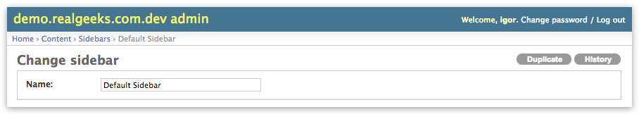

# django-modelclone

Allows users to duplicate a model in admin.

## Installation

    $ pip install django-modelclone

then:

 1. Add `'modelclone'` to `INSTALLED_APPS`
 2. In your `admin.py` files extend from `modelclone.ClonableModelAdmin` instead of
    Django's `ModelAdmin`

The models that have admin configuration extending `modelclone.ClonableModelAdmin` will
have a new link on the Change page to duplicate that object

This links redirects to a page similar to an Add page but with all the fields already
filled with the values from the original object.

Note that you still need to save to get a new object. And make sure to edit fields
that must be unique otherwise you will get a validation error.

## But Django already has a 'save as'

Yes, I know. Django Admin has a [`save_as`](https://docs.djangoproject.com/en/dev/ref/contrib/admin/#django.contrib.admin.ModelAdmin.save_as)
feature that adds a new button to your Change page to save a new instance of that
object.

I don't like the way this feature works because you will save an identical copy of the
original object (if you don't get validation errors) as soon as you click that link, and
if you forget to make the small changes that you wanted in the new object you will end up
with a duplicate of the existing object.

On the other hand, django-modelclone offers an intermediate view, that basically pre-fills
the form for you. So you can modify and then save a new instance. Or just go away without
side effects.

## Requirements

* Python 2.7 or 3.7
* Django 1.8, 1.9, 1.10, 1.11, 2.0 or 2.1

See `tox.ini`

## Hacking

Fork the [repository on github](http://github.com/realgeeks/django-modelclone), make your
changes (don't forget the tests) and send a pull request.

To run the tests, install and run [Tox](http://tox.readthedocs.org/):

    $ pip install tox
    $ tox

You can also run the sample project to test manually. In this case you'll need to
install Django, or just use one of the virtualenvs tox creates, for example:

    $ source .tox/py27-django15/bin/activate

then start the server

    (py27-django15) $ ./manager serve

The app is available on [http://localhost:8000/admin/](http://localhost:8000/admin/),
username and password "admin".
